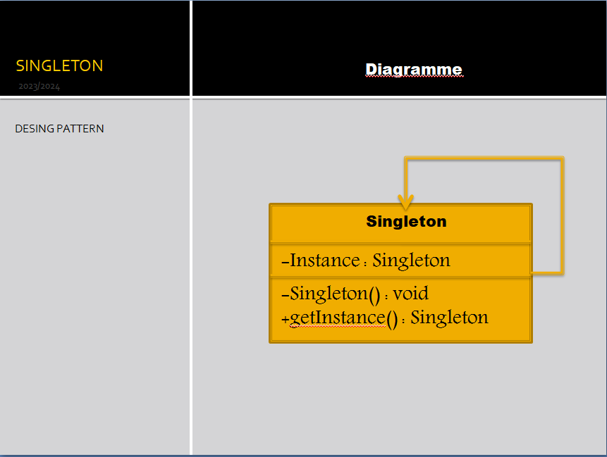

# Design Pattern: Singleton

This repository contains examples and explanations related to the Singleton design pattern. The Singleton pattern is a creational pattern that ensures a class has only one instance and provides a global point to this instance.

## Contents

- Examples: Practical examples demonstrating the use of the Singleton pattern.
- [Usage]: Common scenarios where the Singleton pattern is applicable.



## Singleton Pattern

The Singleton pattern is a creational design pattern that addresses the need for a single instance of a class and provides a global point of access to it. It is particularly useful in scenarios where exactly one instance of a class is required to control actions, coordinate tasks, or manage resources.

### Example Implementation

Here's a basic example of a Singleton implementation in Java:

```java
public class Singleton {
    // The singleton instance
    private static Singleton instance;

    // Private constructor to prevent instantiation from outside
    private Singleton() {
    }

    // Public method to get the singleton instance
    public static Singleton getInstance() {
        // If the instance is null, create a new instance
        if (instance == null) {
            instance = new Singleton();
        }
        // Return the singleton instance
        return instance;
    }
}
